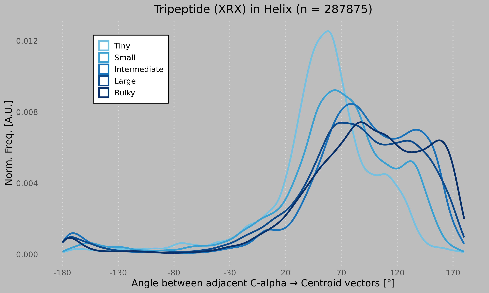

# Arginine Side-Chain Geometry Analysis in Alpha-Helices

A structural bioinformatics pipeline that measures how the steric bulk of a neighboring residue influences the side-chain orientation of Arginine (ARG) in alpha-helical protein structures. Angle distributions are computed across ~50,000 PDB structures and visualized as density curves grouped by neighbor size class.

---

## Overview

For every Arginine found in an alpha-helix across the PDB, the pipeline:

1. Extracts the **tripeptide context** (previous–ARG–next) from STRIDE secondary-structure output.
2. Computes the **signed dihedral angle** between the CA→sidechain-centroid vectors of the previous residue and ARG, using the CA–CA vector as the reference axis.
3. Classifies each measurement by the **size class** of the preceding residue (Tiny → Bulky).
4. Plots the resulting **angle distributions** as colored density curves.

---

## Directory Structure

```
.
├── config.yaml                          # target amino acid (default: ARG)
├── run_pipeline.sh                      # runs all four steps end-to-end
├── secondary_structure_pipeline.smk     # Step 1: decompress PDBs, run STRIDE
├── context_extraction_pipeline.smk      # Step 2: extract tripeptide contexts
├── angle_calculation_pipeline.smk       # Step 3: calculate angles, write TSV
│
├── scripts/
│   ├── extract_tripeptide_context.py    # parse STRIDE output → context TSV
│   ├── calculate_sidechain_angles.py    # compute angles (CA–CA axis)
│   └── plot_angle_distribution.R        # density plot by size class
│
├── smk_commands/                        # pre-built snakemake commands split into chunks
│   └── 1_chunk.sh … 10_chunk.sh
│
├── pdbs/                                # input: gzipped PDB files (*.pdb.gz)
├── unzipped_pdbs/                       # intermediate: decompressed PDBs (temp)
├── stride_output/                       # intermediate: STRIDE output (*.ss.out)
├── tripeptide_contexts/                 # intermediate: per-PDB context TSVs
│
└── results/
    ├── angles.tsv                       # final angle measurements
    ├── angle_plot.png                   # density plot figure
    └── pdb_list.txt                     # list of all PDB IDs analyzed
```

---

## Running the Pipeline

```bash
bash run_pipeline.sh [PDB_DIR] [STRIDE_BIN]
```

- `PDB_DIR` — path to folder containing `.pdb.gz` files (default: `pdbs`)
- `STRIDE_BIN` — path to the STRIDE binary (default: `/usr/local/bin/stride`)

This runs all four steps sequentially with 4 cores each.

---

## Pipeline Steps

### Step 1 — Secondary Structure (`secondary_structure_pipeline.smk`)

```bash
snakemake -s secondary_structure_pipeline.smk --cores <N>
```

Reads `STRIDE_BIN` and `PDB_DIR` from environment variables. Decompresses each `{PDB_DIR}/{pdb}.pdb.gz` to a temporary `unzipped_pdbs/{pdb}.pdb`, then runs STRIDE to produce `stride_output/{pdb}.ss.out`.

For large datasets the `smk_commands/` folder contains pre-split chunk commands that can be run in parallel across nodes:

```bash
bash smk_commands/1_chunk.sh
```

### Step 2 — Context Extraction (`context_extraction_pipeline.smk`)

```bash
snakemake -s context_extraction_pipeline.smk --cores <N>
```

For each PDB, `extract_tripeptide_context.py` reads the STRIDE output and writes a TSV to `tripeptide_contexts/` containing every tripeptide centred on the target amino acid. Each tripeptide is stored as three rows with 14 columns:

| Column | Field | Description |
|--------|-------|-------------|
| 0 | `res3` | 3-letter residue code |
| 1 | `chain` | Chain ID |
| 2 | `resnum` | Residue sequence number |
| 3 | `idx` | Sequential index |
| 4 | `ss_code` | STRIDE secondary-structure code |
| 5 | `ss_name` | STRIDE secondary-structure name |
| 6 | `phi` | Phi dihedral (°) |
| 7 | `psi` | Psi dihedral (°) |
| 8 | `area` | Solvent-accessible surface area |
| 9 | `aa1` | 1-letter residue code |
| 10 | `tripeptide_seq` | Tripeptide sequence (e.g. `LRL`) |
| 11 | `ss_triplet` | Secondary-structure triplet (e.g. `HHH`) |
| 12 | `pdb_id` | PDB identifier |
| 13 | `position_string` | Chain:resnum for all three positions |

### Step 3 — Angle Calculation (`angle_calculation_pipeline.smk`)

```bash
snakemake -s angle_calculation_pipeline.smk --cores <N>
```

`calculate_sidechain_angles.py` iterates over all context TSVs, filters for tripeptides where:

- the **center residue** is the target amino acid (ARG), and
- the **secondary-structure triplet** is `HHH` (all three residues in an alpha-helix),

then computes the signed angle as follows:

```
sidechain_vec_prev = centroid(prev sidechain) − CA(prev)
sidechain_vec_cent = centroid(center sidechain) − CA(center)
helix_axis         = CA_cent − CA_prev
angle              = signed_angle_3d(sidechain_vec_prev, sidechain_vec_cent, helix_axis)
```

The PDB directory is passed as the 4th argument (sourced from the `PDB_DIR` environment variable). Results are written to `results/angles.tsv` with columns: `pdb`, `left_aa`, `size_class`, `angle`.

#### Residue Size Classes

| Class | Residues |
|-------|----------|
| Tiny | G, A |
| Small | V, P, S, T, C |
| Intermediate | L, I, N, D |
| Large | K, M, Q, H, E |
| Bulky | R, F, Y, W |

### Step 4 — Visualization

```r
Rscript scripts/plot_angle_distribution.R
```

Reads `results/angles.tsv` and saves `results/angle_plot.png` — a density plot of angles (−180° to 180°) with one curve per size class, colored from pale blue (Tiny) to deep navy (Bulky).



---

## Configuration

Edit `config.yaml` to change the target amino acid:

```yaml
target_aa: ARG
```

---

## Dependencies

**Python**
- `biopython`
- `numpy`
- `pandas`
- `tqdm`

**R**
- `ggplot2`
- `dplyr`
- `readr`

**External**
- STRIDE — secondary-structure assignment
- [Snakemake](https://snakemake.readthedocs.io/) >= 7.0
